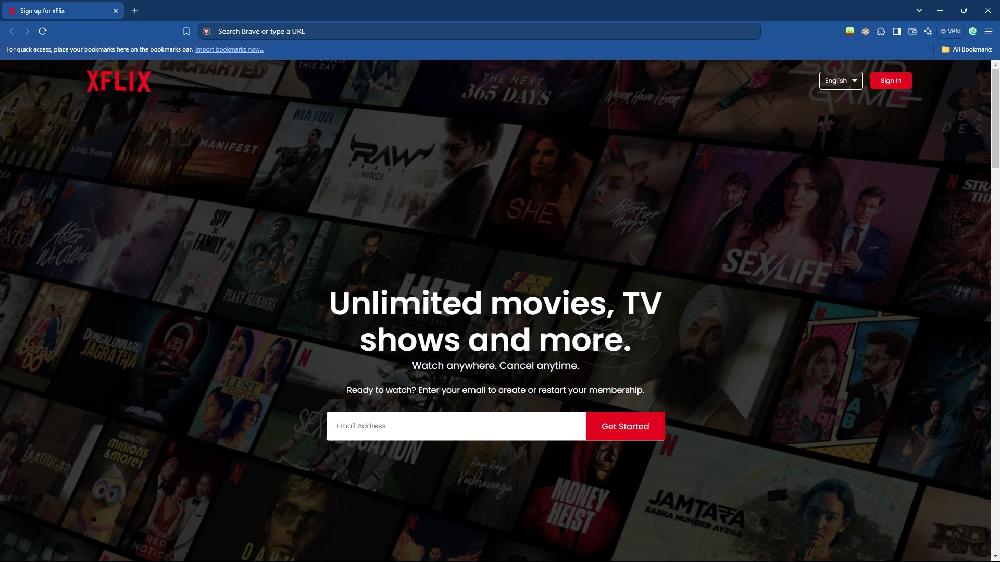
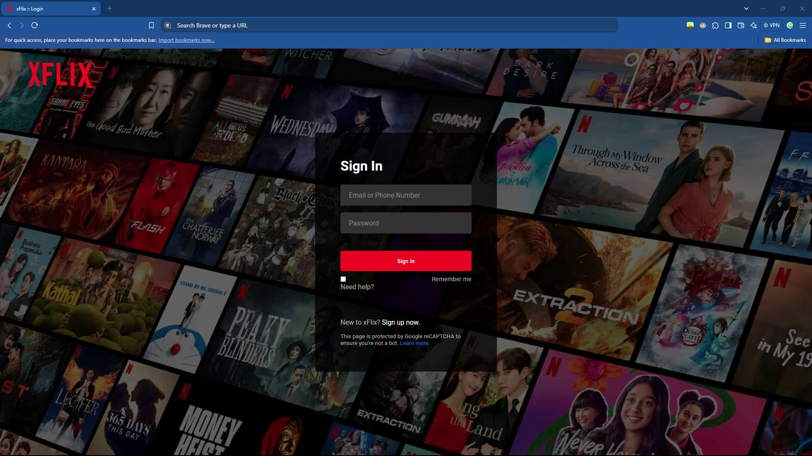
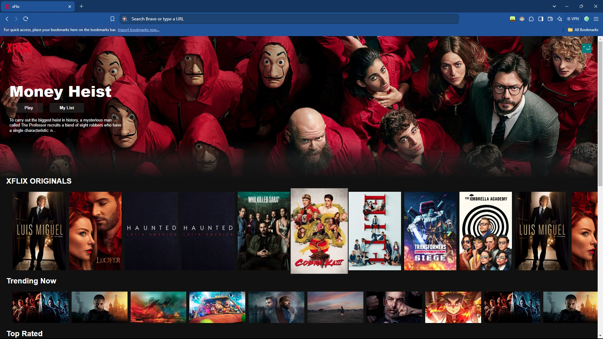

# xFlix

This is a three-part project consisting of a landing page, a login page and a main homepage - a new take on Netflix as a whole using HTML, CSS and a little bit of JavaScript.

The assets can be found: [here](https://drive.google.com/drive/folders/1OeMF3nGzdJ0MYMEISOyQNLD2Ma6rm2a_?usp=sharing), [here](https://drive.google.com/file/d/1ttnllr6Bpe_0C-9OfV_uKWiXVWQHWdkc/view) and [here](https://drive.google.com/file/d/1rjxWOGrgOSiApJ-h7R9QQqMusU0VCGix/view).

**(Thanks GreatStack, CodingNepal & FutureCoders)**
## Acknowledgements

 - Tutorial(s) by: [GreatStack](https://www.youtube.com/@GreatStackDev), [CodingNepal](https://www.youtube.com/@CodingNepal) & [Future Coders](https://www.youtube.com/@FutureCoders)

 - A huge shoutout to my youngest project as of writing this: [LinkedX](https://github.com/l-xdt/linkedx/)
 
 - A huge help in this project: [DiffChecker](https://www.diffchecker.com/)
## Authors

- [LeidenSchaft-Xiotim Development Team](https://www.github.com/l-xdt)

- [Alvin Maranx, II ツ (Avun)](https://www.github.com/avunii)

- [GreatStack](https://www.youtube.com/@GreatStackDev)

- [CodingNepal](https://www.youtube.com/@CodingNepal)
 
- [Future Coders](https://www.youtube.com/@FutureCoders)
## Demo

There is a demo on this project! and I'm not being indirect, here is the link: click [here](https://l-xdt.github.io/xflix/)
## Features

- Change the images.

- Mostly reliant on images.

- Does not require the internet.

- You are in control of the program.

- **PS:** There is a lot to be discovered on your own, so you have some exploring to do.
## Screenshots







**Written in plain HTML, CSS and a little bit of JavaScript, the rest you have to figure out.**

## Run Locally

Clone the project - and run it on XAMPP.

```bash
  git clone https://github.com/l-xdt/xflix
```

Go to the project directory

```bash
  cd xflix
```

Install XAMPP (via Chocalatey, if you don't have it.)

```bash
      chocalatey install xampp
```

Start the server

```bash
      [Directory]/[ServerName]/apache-start.bat
```

**PS:** If you trust your web skills, here is a manual on how to self-host a domain [here](https://www.youtube.com/watch?v=_eQGAJVtRCs) (by Soeng Souy)
## Roadmap

- Change the Images.

- Change the HTML.

- Change the CSS.

- Change whatever you would like to make it your own.

- Change the icons.

- Change the code.

- Inspired by our **signature: X**, which you can change if you wanted.
## Support

For support, shoot a message to either of our emails: [here](mailto:leidenschaft.tech@hotmail.com) or [here](mailto:trowesigames@gmail.com) or join our Discord Server: which is not up as of writing this.
## Feedback

This applies to feedback aswell, Whether you want to give us positive words of encouragement, or negative words, send away! (but please, only send constructive critisism.)

Send away: [here](mailto:leidenschaft.tech@hotmail.com) or [here](mailto:trowesigames@gmail.com).

## FAQ

**Now for my favourite, FAQ!**

#### Can I modify this to fit my needs?

Yeah! why of-course, that is why this is even published onto the internet.

#### Can I host this, if I can how?

Yes, you can! with my favourite Apache container, XAMPP! Since I have explained it 20 times, I'm not kidding, we can skip the explanation because you know the drill.

So! Here is a [download](https://www.apachefriends.org/download.html) to the server. XAMPP (of-course)! And if you are struggling about you can start hosting with this [tutorial](https://www.youtube.com/watch?v=LzucEZh4_no) (by MainlyWebStuff).

And if you truly trust your web skills, you can use this [tutorial](https://www.youtube.com/watch?v=_eQGAJVtRCs) (by Soeng Souy) to self-host a domain.
## Used By

This project is used by the following companies:

- LeidenSchaft-Xiotim Accqusitions (Limited).

- XDT-Studium.

- Xiotim Development Team [Limited] (XDT).

- XDT-noHesi.
## Related

- Here are some related projects:

- [xFlix - This Project](https://github.com/l-xdt/xflix)

- [LinkedX](https://github.com/l-xdt/linkedx)

- [Main Website](https://github.com/l-xdt/l-xdt.github.io/)

- [FTP (x-FTP)](https://github.com/l-xdt/ftp/)

- [L-XDT](https://github.com/l-xdt/l-xdt/)

- [Documentation (x-Doc)](https://github.com/l-xdt/documentation/)

- [Phone (xPhone-UI)](https://github.com/l-xdt/phone/)

- [xLinks](https://github.com/l-xdt/xlinks/)

- [XInterest](https://github.com/l-xdt/xinterest/)

- [Xelegram](https://github.com/l-xdt/xelegram/)

- [XApp](https://github.com/l-xdt/xapp/)

- [XCord](https://github.com/l-xdt/xcord/)

- [XChat](https://github.com/l-xdt/xchat/)

- [XGram](https://github.com/l-xdt/xgram/)

- [xSocial](https://github.com/l-xdt/xSocial/)

- [Xirox](https://github.com/l-xdt/xirox/)

- [XioTube](https://github.com/l-xdt/xiotube/)

- [Studium](https://github.com/l-xdt/studium/)

- [XioTok](https://github.com/l-xdt/xiotok/)

- [XioTim](https://github.com/l-xdt/xiotim/)

- [no-Hesi](https://github.com/l-xdt/no-hesi/)


## Documentation

- I don't have any proper documentation, but I can give you the links to the tutorials:

- [CodingNepal's Tutorial (on YouTube)](https://www.youtube.com/watch?v=QfXSttYBeY8)

- [GreatStack's Tutorial (on YouTube)](https://www.youtube.com/watch?v=Tgat3-prVv4)

- [FutureCoder's Tutorial (on YouTube)](https://www.youtube.com/watch?v=9nywQdjKnJI)

## API Reference

There are no APIs to be known of, used in this project. This project only consists of Vanilla HTML, CSS and JS and Images, not even FontAwsome. No frameworks either, If there is I will update the readMe.

